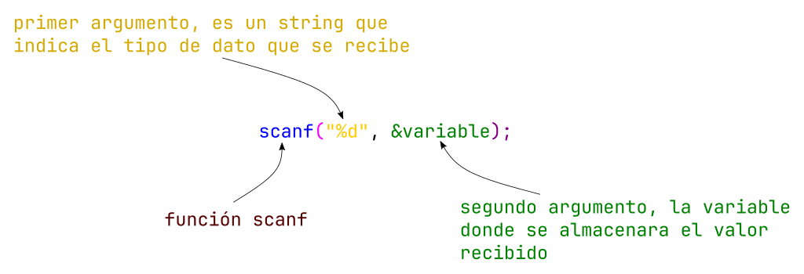

# Leyendo datos del usuario - Función `scanf()`

Para ir mejorando nuestros programas, que sean dinámicos y mucho mas funcionales, debemos recibir información por parte del usuario. Para ello una manera es leyendo datos de teclado que ingresa el usuario, y esto es lo que nos permite realizar la función `scanf()`. Que podríamos decir que complementa a la función `printf()`.

En la siguiente imagen se ve como cada parte de la sentencia:



En el siguiente ejemplo vemos como quedaría un código:

```c
#include <stdio.h>

int main(){
    int edad = 0;

    printf("Dar el valor de la tu edad: ");
    scanf("%d", &edad); //recibo el dato y lo almaceno en la variable edad

    int edadNueva = edad + 5; // hago una operación con este valor 

    printf("Tu edad en 5 anios sera de: %d\n", edadNueva);// Recuerda que los símbolos del abecedario ingles no tiene la eñe, y no podemos poner de manera directa ese símbolo especial
}
```

## Ejemplos

- Calcular el promedio de una materia, solicitar cada parcial (3) al usuario, e imprimir el resultado con una frase, ejemplo: "Tu promedio es: 5.4"

```c
#include <stdio.h>

int main(){
    
    float cal1 = 0;
    float cal2 = 0;
    float cal3 = 0;

    printf("Dar la calificacion 1: ");
    scanf("%f", &cal1);
    printf("Dar la calificacion 2: ");
    scanf("%f", &cal2);
    printf("Dar la calificacion 3: ");
    scanf("%f", &cal3);

    float promedio = (cal1 + cal2 + cal3) / 3;

    printf("Tu promedio es %.2f\n", promedio);
    return 0;
}
``` 

## Ejercicios

- **Calculadora del circulo**. Imprimir calcular el perímetro y área. Solicitar los datos al usuario. Dar formato a la salida del resultado, ejemplo: "El area del circulo es 32.4 u2", "El perímetro del circulo es 11.34 u"
- **Calculadora de Fuerza (Segunda Ley de Newton)**: Solicitar al usuario el valor de la *masa* y la *aceleración*, hacer el calculo de la fuerza. Formula $F=masa * aceleración$. El mensaje de salida debe tener el siguiente formato =="*La fuerza es 87.65 N*"==
- **Calculadora de Corriente (Ley de Ohms)**: Solicitar al usuario el valor del *voltaje* y la *resistencia*. Hacer el calculo de la corriente. Formula $I = \frac{Voltaje}{Resistencia}$.