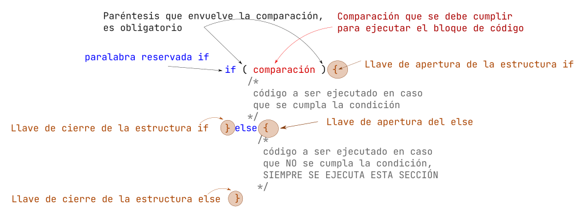

# Decisiones (if-else)

Vimos la estructura `if` básica, ahora conoceremos quien lo complementa, y este es el bloque `else`.

La estructura `if-else` (`si - de lo contrario`) o estructura de decision `if-else`.



## Estructura `if-else`

La sintaxis de la estructura `if-else` es la siguiente:

```c
if (comparacion_a_true){
   // bloque "if" que se ejecutara si la companion resulta verdadera
}else{
   // bloque "else" que se ejecutara si la companion resulta verdadera
}
```

El anterior código que hicimos lo podemos mejorar con la siguiente modificación:

```c
#include <stdio.h>

int main(){

    int edad = 18;

    if (edad >= 18){ // comparamos si la variable edad es mayor o igual a 18, en caso que sea verdadero se mostrara el texto
        printf("Eres mayor de edad");
    }else{ // comparamos la variable
        printf("Eres menor de edad");
    }
    return 0;
}
```

## `if-else` anidados

```c
if (comparacion_a_true){
   // bloque "if" que se ejecutara si la companion resulta verdadera
   if (comparacion_a_true){
   // bloque "if" que se ejecutara si la companion resulta verdadera
        if (comparacion_a_true){
        // bloque "if" que se ejecutara si la companion resulta verdadera
        }else{
        // bloque "else" que se ejecutara si la companion resulta verdadera
        }
    }else{
    // bloque "else" que se ejecutara si la companion resulta verdadera
    }
}else{
   // bloque "else" que se ejecutara si la companion resulta verdadera
   if (comparacion_a_true){
   // bloque "if" que se ejecutara si la companion resulta verdadera
    }else{
    // bloque "else" que se ejecutara si la companion resulta verdadera
    }
}
```

```c
    if(comparacion_a_true){
        // bloque "if" que se ejecutara si la companion resulta verdadera de lo contrario va al siguiente
    }else if (comparacion_a_true){
        // bloque "if" que se ejecutara si la companion resulta verdadera de lo contrario va al siguiente
    }else if (comparacion_a_true){
        // bloque "if" que se ejecutara si la companion resulta verdadera de lo contrario va al siguiente
    }else if (comparacion_a_true){
        // bloque "if" que se ejecutara si la companion resulta verdadera de lo contrario va al siguiente
    }else{
        // en caso que no entro en ningún if previo entra y se ejecuta este código
    }
```

## Ejercicios

**Calculadora del Cuadrado**:

- opción 1) perímetro
- opción 2) area
- en caso que de otra opción indicar que "no existe la opción"

```c
#include <stdio.h>

int main(void){

    float side = 0.0;
    int option = 0;
    printf("CALCULADORA DEL CUADRADO\n");
    printf("1) Area\n");
    printf("2) Perimetro\n");
    scanf("%d", &option);

    if (option == 1){
        printf("Area\n");
        printf("Dar el lado: ");
        scanf("%f", &side);
        printf("El area es %.2f\n", (side * side));
    }else if (option == 2){
        printf("Perimetro\n");
        printf("Dar el lado: ");
        scanf("%f", &side);
        printf("El perimetro es %.2f\n", (side * 4));
    }else{
        char* frase = "opcion no existe\n";
        printf("%s\n", frase);
    }
    return 0;
}
```

- **Solicitar un numero al usuario, e imprimir si el numero es "par" o "impar"**

```c
#include <stdio.h>

int main(void){

    int value = 0;
    printf("Dar un valor: ");
    scanf("%d", &value);

    if (value % 2 == 0){
        printf("Es par\n");
    }else{
        printf("Es Impar\n");
    }
    return 0;
}
```

- **Dar 2 números e indicar cual es el mayor de los 2, o sin son iguales**

```c
#include <stdio.h>

int main(void){

    int valor1 = 0;
    int valor2 = 0;
    printf("Dar un valor 1: ");
    scanf("%d", &valor1);

    printf("Dar un valor 2: ");
    scanf("%d", &valor2);

    if (valor1 > valor2){
        printf("%d es mayor que %d\n", valor1, valor2);
    }else if (valor1 < valor2){
        printf("%d es mayor que %d\n", valor1, valor2);
    }else{
        printf("%d es igual a %d\n", valor1, valor2);
    }
    return 0;
}
```

## Ejercicios (*if-else*)

- Solicitar un numero al usuario, e imprimir si el numero es "**múltiplo de 3**" o "**NO múltiplo de 3**".(Es decir, es divisible entre 3)
- Calculadora de Ley de ohm. Dar las 4 opciones al usuario.
  - 1) Calcular Voltaje
  - 2) Calcular Corriente
  - 3) Calcular Resistencia
  - 4) Salir del programa
  - Si da una opción que no existe, debe indicarlo y terminar el programa
- Calculo de resistencia en serie y paralelo, Se le dará lan opciones al usuario para elegir que desea calcular, es decir,
  - si paralelo o serie,
  - después solicita 3 valores e imprime el resultado.
  - Si da un opción no valida, no solicita nada y termina el programa
  - Ecuación se serie $R_T = \Sigma_{i=1}^{n} R_{i}$
  - Ecuación paralelo $R_T= \frac{1}{\Sigma_{i=1}^{n}\frac{1}{R_i} }$
- Calcular el promedio final, solicita al usuario sus calificaciones parciales una a una, y al final da el mensaje "Aprobado", en caso que haya pasado arriba de 6 y "Estas en repite" si es menor.

---

## Operadores lógicos

Un operador lógico sirve para combinar comparaciones y en función del resultado tomar una decisión, comprende de 3 operadores
(*hay mas pero no lo veremos aquí*) que son `AND`, `OR` y `NOT`. Con todo ello para realizar varias validaciones y obtener un resultado `booleano`.

## Las tablas de verdad de los operadores

### AND (Y) -> (&&)

|Entrada 1 | Entrada 2 | Salida
|-|-|-|
|`false` | `false` | `false`|
|`false` | `true` | `false`|
|`true` | `false` | `false`|
|`true` | `true` | `true`|

!!! note "Regla"
    ***AND** nos dice que mientras exista a la entrada un `false`, tendremos un valor `false` a la salida*

### OR (O) -> (||)

|Entrada 1 | Entrada 2 | Salida|
|-|-|-|
|`false` | `false` | `false`|
|`false` | `true` | `true`|
|`true` | `false` | `true`|
|`true` | `true` | `true`|

!!! note "Regla"
    ***OR** nos dice que mientras exista a la entrada un `true`, tendremos un valor `true` a la salida*

### NOT (NO) (Inverter) -> (!)

|Entrada| Salida|
|-|-|
|`false` | `true`|
|`true` | `false`|

!!! note "Regla"
    ***NOT** nos dice que todo lo que recibe lo invierte.*

### Sintaxis con operadores lógicos

La forma en la que se escriben las comparaciones con operadores lógicos es:

|Izquierda|Centro|Derecha|
|:-:|:-:|:-:|
|`comparación`|`operador lógico`|`comparación`|
|`(a == b)`|`&&` |`(x > y)`
|`(5 == 8)`|`&&` |`(9 > 4)`
|`(a >= b)`|`||`|`(0 == 8)`
|`(10 <= x)`|`&&`|`(1 != -8)`
|`(a <= 2)`|`||`|`(0 == 8)`

En el caso de `not` aplica solo a una comparación:

|Aplicación | Resultado
|:-:|:-:|
|`!true`  | `false`|
|`!(3 == 3)` |`false` |
|`!(6 >= 1)` | `false`|
|`!(1 != 1)` |`true`|
|`!(3 < 3)` |`true`|

Se pueden concatenar (unir) **n comparaciones** con operadores lógicos, pero siempre se debe utilizar el operador para poder unir mas comparaciones, ejemplo:

`(5 == 8)` `&&` `(9 > 4)` `||` `(a >= b)` `||` `(0 == 8)` `&&` `!(2 == 2)`

### Ejemplos de comparación

| Descripción | Resultado
|-|:-:|
|`(9 > 4)` `&&` `(3 < 6)` | `true`
|`(8 == 3)` `||``(2 != 3)` | `true`
|`!true` | `false`
|`(5 == 8)` `&&` `(9 > 4)`| `false`
|`(0 >= -5)` `||``(0 == 8)`| `true`
|`(10 <= 5)` `&&` `(1 != -8)`| `false`
|`!(2 == 2)`| `false`

## Ejemplos (operadores lógicos)

- Solicitar un número de entre 0 al 20, si el número es menor a 10 **Y** par, indicar que el "número es par y menor a 10"; si es menor a 10, pero NO es **par** dar el mensaje "Número menor a 10", de lo contrario que indique que es mayor a 10.

## Ejercicios (operadores lógicos)

- Preguntar al usuario si le "gusta correr" y después si le "gusta nadar", si ambos casos responde que *1)si* *2)no*, mandar el mensaje de que "es muy fitness", de lo contrario "deberías hacer más ejercicio" (Operadores lógicos)
- En una variable almacena la calificación, se debe verificar el valor de la calificación es valida; es decir, calificaciones arriaba de 10 **Y** abajo de 0, "no es posibles"; si la calificación es menor o igual a 10 **Y** mayor o igual a cero, debe indicar que es correcta la calificación.

> ***Nota**: No es la única forma en la que se pueden realizar estos ejemplos y ejercicios, recuerda que lo importante es resolver el problema, que hayan más o menos pasos, diferentes formulas, etc, no significa que este mal*.
