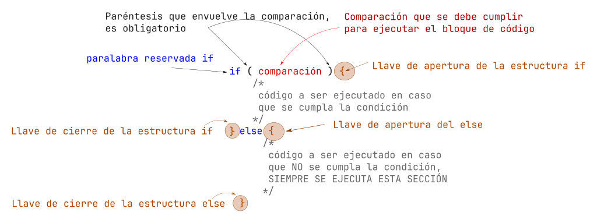

# Decisiones (if-else)

Vimos la estructura `if` básica, ahora conoceremos quien lo complementa, y este es el bloque `else`. 

La estructura `if-else` (`si - de lo contrario`) o estructura de decision `if-else`.



## Estructura `if-else`

La sintaxis de la estructura `if-else` es la siguiente:

```c
if (comparacion_a_true){
   // bloque "if" que se ejecutara si la companion resulta verdadera
}else{ 
   // bloque "else" que se ejecutara si la companion resulta verdadera
}
```

El anterior código que hicimos lo podemos mejorar con la siguiente modificación:


```c
int edad = 18;

if (edad >= 18){ // comparamos si la variable edad es mayor o igual a 18, en caso que sea verdadero se mostrara el texto
    printf("Eres mayor de edad");
}else{ // comparamos la variable
    printf("Eres menor de edad");
}
```

## `if-else` anidados

```c
if (comparacion_a_true){
   // bloque "if" que se ejecutara si la companion resulta verdadera
   if (comparacion_a_true){
   // bloque "if" que se ejecutara si la companion resulta verdadera
        if (comparacion_a_true){
        // bloque "if" que se ejecutara si la companion resulta verdadera
        }else{ 
        // bloque "else" que se ejecutara si la companion resulta verdadera
        }
    }else{ 
    // bloque "else" que se ejecutara si la companion resulta verdadera
    }
}else{ 
   // bloque "else" que se ejecutara si la companion resulta verdadera
   if (comparacion_a_true){
   // bloque "if" que se ejecutara si la companion resulta verdadera
    }else{ 
    // bloque "else" que se ejecutara si la companion resulta verdadera
    }
}
```


```c
    if(comparacion_a_true){
        // bloque "if" que se ejecutara si la companion resulta verdadera de lo contrario va al siguiente
    }else if (comparacion_a_true){
        // bloque "if" que se ejecutara si la companion resulta verdadera de lo contrario va al siguiente
    }else if (comparacion_a_true){
        // bloque "if" que se ejecutara si la companion resulta verdadera de lo contrario va al siguiente
    }else if (comparacion_a_true){
        // bloque "if" que se ejecutara si la companion resulta verdadera de lo contrario va al siguiente
    }else{
        // en caso que no entro en ningún if previo entra y se ejecuta este código
    }
```

## Ejercicios

**Calculadora del Cuadrado**:
    - opción 1) perímetro 
    - opción 2) area
    - en caso que de otra opción indicar que "no existe la opción"

```c
#include <stdio.h>

int main(void){

    float side = 0.0;
    int option = 0;
    printf("CALCULADORA DEL CUADRADO\n");
    printf("1) Area\n");
    printf("2) Perimetro\n");
    scanf("%d", &option);

    if (option == 1){
        printf("Area\n");
        printf("Dar el lado: ");
        scanf("%f", &side);
        printf("El area es %.2f\n", (side * side));
    }else if (option == 2){
        printf("Perimetro\n");
        printf("Dar el lado: ");
        scanf("%f", &side);
        printf("El perimetro es %.2f\n", (side * 4));
    }else{
        char* frase = "opcion no existe\n";
        printf("%s\n", frase);
    }
    return 0;
}
```

- **Solicitar un numero al usuario, e imprimir si el numero es "par" o "impar"**

```c
#include <stdio.h>

int main(void){
    
    int value = 0;
    printf("Dar un valor: ");
    scanf("%d", &value);

    if (value % 2 == 0){
        printf("Es par\n");
    }else{
        printf("Es Impar\n");
    }
    return 0;
}
```
- **Dar 2 números e indicar cual es el menor de los 3**

```c
#include <stdio.h>

int main(void){
    
    int valor1 = 0;
    int valor2 = 0;
    printf("Dar un valor 1: ");
    scanf("%d", &valor1);
    
    printf("Dar un valor 2: ");
    scanf("%d", &valor2);

    if (valor1 > valor2){
        printf("%d es mayor que %d\n", valor1, valor2);
    }else if (valor1 < valor2){
        printf("%d es menor que %d\n", valor1, valor2);
    }else{
        printf("%d es igual a %d\n", valor1, valor2);
    }
    return 0;
}
```

## Ejemplos

- Solicitar un numero al usuario, e imprimir si el numero es "**múltiplo de 3**" o "**NO múltiplo de 3**"
- Calculadora de Ley de ohm. Dar las 4 opciones al usuario.
        - 1) Calcular Voltaje
        - 2) Calcular Corriente
        - 3) Calcular Resistencia
        - 4) Salir del programa
        - Si da una opción que no existe, debe indicarlo y terminar el programa
- Calculo de resistencia en serie y paralelo, Se le dará lan opciones al usuario para elegir que desea calcular, es decir, 
    - si paralelo o serie,
    - después solicita 3 valores e imprime el resultado.
    - Si da un opción no valida, no solicita nada y termina el programa
