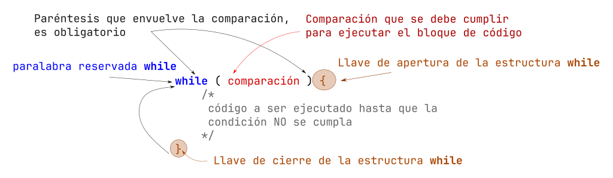

# Introducción a ciclos (while)

Si deseas conocer la teoría básica de ciclos, ve a la documentación de [algoritmos en la sección de ciclos](https://www.alejandro-leyva.com/algoritmos/12_ciclos/)

## Estructura del ciclo `while`

El primer ciclo que vamos a conocer se llama `while` (*mientras*). Este ciclo, primero verifica una comparación y en caso que se cierta o de como resultado `true`, entrara al bloque de código que esta entre las llaves, una vez termina la ultima linea; es decir, antes de la llave de cierre, vuelve a la comparación inicial y evalúa la comparación, en caso que sea `true` repite el ciclo, de lo contrario termina y continua la ejecución del programa.



```c
while(comparacion_a_true){ //inicia bloque while

    // bloque de código que se repite 
    // hasta que la companion no se cumpla

} //termina bloque while
```

## Ejemplos

- Imprimir 5 veces la palabra "Hola"
- Imprimir del 0 al 5
