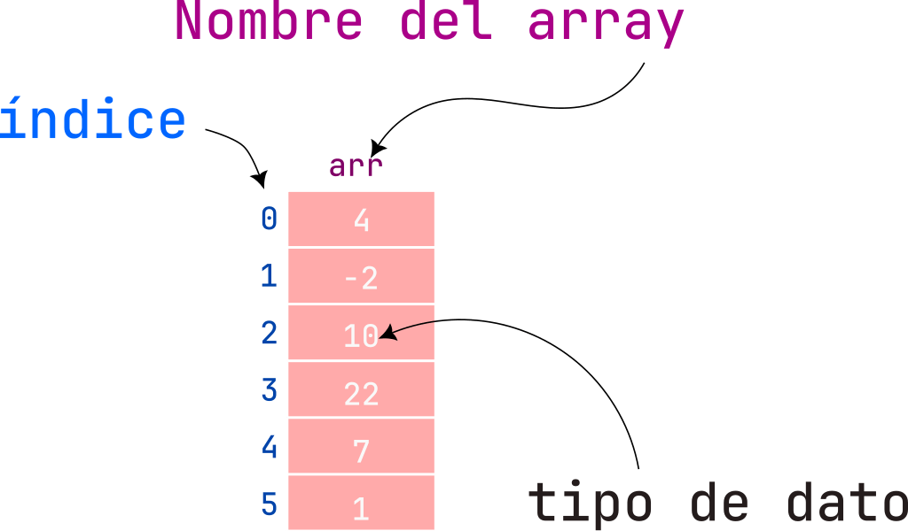
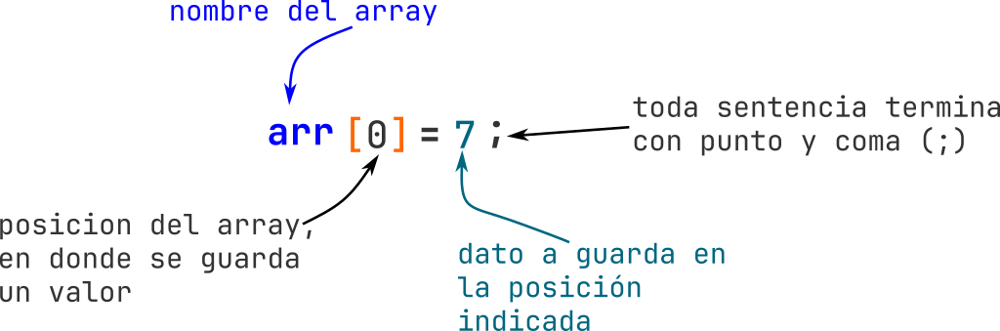
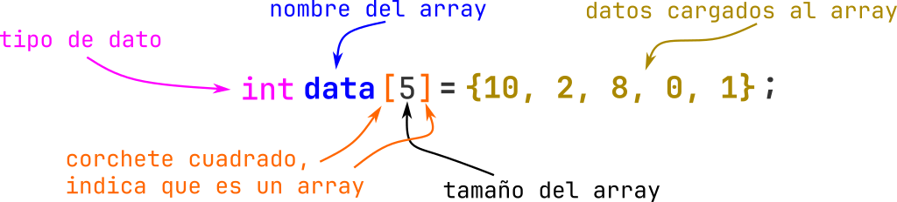

# Arrays (Arreglos)

Los arreglos son estructuras de datos que consisten en elementos de datos relacionados del mismo tipo.

Los arreglos y las estructuras son entidades “estáticas” que mantienen el mismo tamaño durante la ejecución del programa, por lo tanto, crearse y destruirse cada vez que se entra y se sale de los bloques en los que se definen.

**Un arreglo es un grupo consecutivo de localidades de memoria relacionadas por el hecho de que tienen el mismo nombre y el mismo tipo. Para hacer referencia a una localidad o a un elemento del arreglo en particular, especificamos el nombre del arreglo y la posición numérica del elemento en particular dentro del arreglo.**

Podemos ver como se representaría un array:

- Nombre del array: **arr**
- Tamaño: **6**
- Posiciones: **0 al 5**
- Tipo: **int** (Enteros)



## Declaración de un array

Debemos recordar que un array solo puede contener un solo tipo de dato, por lo tanto, primero se indica el tipo de dato que tendrá, seguido de corchetes cuadrados y dentro de los corchetes indicamos la cantidad de espacio que tendrá para almacenar datos `[ size ]`, esto indica que es un array.

Los arreglos ocupan espacio en memoria. El programador especifica el tipo de cada arreglo y el número de elementos que necesita el arreglo, de manera que la computadora pueda reservar la cantidad adecuada de memoria.

### Estructura de declaración de un array


### Ejemplo de declaración de un array


> Nota: Esta forma es para arrays vacíos; es decir, solo se define el espacio que tendrá.

## Agregando datos en el array

Para agregar datos a un array debemos indicar la posición y asignar el valor que queremos.



```c
#include <stdio.h>

int main(){

    int arr[5]; // Array de 5 espacios
    arr[0] = 4;  // Agredo el valor 4 a la posición 0
    arr[1] = -2; // Agredo el valor -2 a la posición 1
    arr[2] = 10; // Agredo el valor 10 a la posición 2
    arr[3] = 22; // Agredo el valor 22 a la posición 3
    arr[4] = 7;  // Agredo el valor 7 a la posición 4

  return 0;
}

```

## Obteniendo datos de un array

Para obtener los datos de un array se indica la posición y este valor es devuelto; con esto ya podemos guardarlo en una variable o usarlo.

### De manera manual

```c
#include <stdio.h>

int main(){

  int arr[5]; // Array de 5 espacios

  arr[0] = 4;  // Agredo el valor 4 a la posición 0
  arr[1] = -2; // Agredo el valor -2 a la posición 1
  arr[2] = 10; // Agredo el valor 10 a la posición 2
  arr[3] = 22; // Agredo el valor 22 a la posición 3
  arr[4] = 7;  // Agredo el valor 7 a la posición 4

  int valor1 = arr[0]; // obtengo o saco el valor de la posición 0
  int valor2 = arr[1]; // obtengo o saco el valor de la posición 1
  int valor3 = arr[2]; // obtengo o saco el valor de la posición 2
  int valor4 = arr[3]; // obtengo o saco el valor de la posición 3
  int valor5 = arr[4]; // obtengo o saco el valor de la posición 4

  printf("El valor 1 es %d\n", valor1);
  printf("El valor 2 es %d\n", valor2);
  printf("El valor 3 es %d\n", valor3);
  printf("El valor 4 es %d\n", valor4);
  printf("El valor 5 es %d\n", valor5);

  return 0;
}

```

**Salida:**

```text
El valor 1 es 4
El valor 2 es -2
El valor 3 es 10
El valor 4 es 22
El valor 5 es 7
```

### Usando un `for`

```c
#include <stdio.h>

int main(){

  int arr[5]; // Array de 5 espacios

  arr[0] = 4;  // Agredo el valor 4 a la posición 0
  arr[1] = -2; // Agredo el valor -2 a la posición 1
  arr[2] = 10; // Agredo el valor 10 a la posición 2
  arr[3] = 22; // Agredo el valor 22 a la posición 3
  arr[4] = 7;  // Agredo el valor 7 a la posición 4

  for (int i = 0; i < 5; i++){
    int valor = arr[i]; //obtengo el valor de la posición indicada
    printf("El valor en la posicion %d es : %d\n", i, valor );
  }

  return 0;
}
```

**Salida:**

```text
El valor en la posicion 0 es : 4
El valor en la posicion 1 es : -2
El valor en la posicion 2 es : 10
El valor en la posicion 3 es : 22
El valor en la posicion 4 es : 7
```

## Arrays inicializados con datos




## Ejemplos

- Declarar un array de 10 espacios y llenarlo del 1 al 10. Después, imprimir todos los valores.

```c
#include <stdio.h>

#define SIZE 10

int main() {

 int numeros[SIZE]; //declaro array de 10 espacios

 for(int i = 0; i < SIZE; i++){ //llenado el array del 1 al 10
  numeros[i] = i + 1;
 }

 for(int index = 0; index < SIZE; index++){ //imprimiendo todo el array
  printf("Posicion [%d] - valor: %d\n", index, numeros[index]);
 }

 return 0;
}
```

- Declarar un array de 7 espacios y llenarlo con *números al azar*. Después, imprimir todos los valores.

```c
#include <stdio.h>
#include <stdlib.h>
#include <time.h>

#define SIZE 7
#define MAX 100  //el numero máximo al azar

int main() {
 srand(time(NULL));
 int numeros[SIZE]; //declaro array de 10 espacios

 for(int i = 0; i < SIZE; i++){ //llenado el array con números al azar
  int numeroRandom = rand() % (MAX + 1);
  numeros[i] = numeroRandom ;
 }

 for(int index = 0; index < SIZE; index++){ //imprimiendo todo el array
  printf("Posicion [%d] - valor: %d\n", index, numeros[index]);
 }

 return 0;
}
```

- Leer 5 números enteros almacenarlos en un array. Imprimirlos en orden inverso.

```c
#include <stdio.h>

#define SIZE 5

int main() {

 int numeros[SIZE]; //declaro array de 10 espacios

 for(int i = 0; i < SIZE; i++){ //llenado el array con números al azar
    int numero = 0;
    printf("[%d]Da un numero entero: ", i+1);
    scanf("%d", &numero);
    numeros[i] = numero;
 }

 printf("++++++++++++++++++++++++\n");

 for(int index = SIZE-1; index >= 0; index--){ //imprimiendo todo el array
    printf("Posicion [%d] - valor: %d\n", index, numeros[index]);
 }

 return 0;
}
```

- Llenar un array a partir un número que elija el usuario, después solicitar números al usuario para llenar el array, crear otro array y llenarlo con los mismo valores al doble e imprimir la sumatoria de los números que están al doble.

```c
#include <stdio.h>
#include <math.h>

int main() {

 int size = 0;
 long sumDoble = 0;
 long sum = 0;

 printf("Da el tamanio del array que quieres crear: ");
 scanf("%d", &size);

 int datos[size];
 int datosDobles[size];

 for(int i = 0; i < size; i++){
  printf("Da el datos %d: ", i+1);
  scanf("%d", &datos[i]);
 }

 for(int i = 0; i < size; i++){
  datosDobles[i] = pow( datos[i], 2 );
 }

 printf("Los datos al doble:\n");
 for(int i = 0; i < size; i++){
  printf("%d\t", datosDobles[i]);
  sum += datos[i];
  sumDoble += datosDobles[i];
 }
 printf("\nLa suma basica: %ld\n", sum);
 printf("La suma basica al doble: %ld\n", sumDoble);

 return 0;
}
```

- Calculo de la media, la desviación estándar y varianza, de una serie de datos que serán dados por el unario, de igual manera, la cantidad de datos se le solicitan al usuario.

```c
```

- Crear un array con 5 espacios, llenarlo con valores al azar y crear una gráfica de barras

```c
```

- Llenar un array de 10 posiciones con números al azar; después, se deben cambiar los números pares por un cero.

```c
```

## Ejercicios

- Contar cuántos elementos negativos hay en un array de 10 números. De un array con datos por default.
- Se debe llenar un array con 5 valores impares, solicitar al usuario valores, pero solo los valores impares se deben almacenar, hasta que se haya llenado el array, se termina de solicitar valores e imprime los valores guardados.
- Declarar un array de 8 espacios y llenarlo a partir de un valor dado por el usuario; es decir, si dan el valor de 3, comienza llenando los espacios con 3, 4, 5, ... hasta terminar. Después, imprimir el primer y ultimo valor.
- Calculo de la media, la desviación estándar, varianza y la moda, de 10 datos. Todos los datos se le solicitan al usuario. Crear una gráfica de barras con los datos
- Encontrar el valor máximo y mínimo de un array de 6 números ingresados por el usuario e indicar cual es la diferencia entre esos valores.
- Leer dos arrays de 5 enteros cada uno y mostrar la suma de cada elemento en su posición homologa; es decir, sumar del array_1 de la posición 0 con el valor del array_2 de la posición 0, asi sucesivamente.
