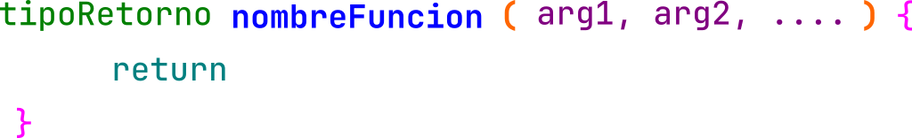
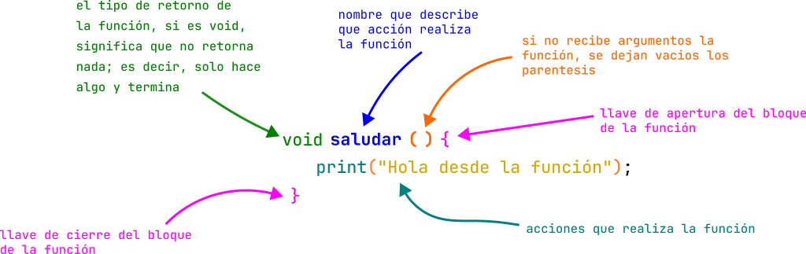

# Funciones

Una función es un bloque de código que se puede reutilizar, con esto podemos crear mejor software, mantenible y entendible.
Las funciones se pueden a llamar las veces que sean necesarias y ellas pueden existir la cantidad de instrucciones que se pueden ejecutar no tienen limite (existen buenas practicas para escribir funciones).

Tenemos varias formas para crear una función, que devuelven algún valor, que no retornen nada, que puedan recibir argumentos o ninguno, siempre todo esto esta en función de lo que vayamos a realizar.

> Aquí solo verán funciones con argumentos por valor, NO POR REGENCIA

## Tipos de retorno de una función

| Nombre | Tipo| Tipo de valor de retorno|
| --- | --- | --|
| void | `void` | No retorna nada|
| byte | `byte` | Retorna del tipo byte|
| Carácter sin signo | `unsigned char` | Retorna del tipo carácter sin singo|
| Carácter con signo | `char` | Retorna del tipo carácter con singo|
| Entero corto sin signo | `unsigned short int` o `unsigned short` | Retorna del tipo short sin signo|
| Entero corto con signo | `short int` | Retorna del tipo short con signo|
| Entero con signo | `int` | Retorna del tipo  Entero con signo|
| Entero largo | `long int` | Retorna del tipo Entero largo|
| Entero largo sin signo | `long long int` | Retorna del tipo Entero largo sin signo|
| Flotante | `float` | Retorna del tipo flotante|
| Doble | `double` | Retorna del tipo Doble|
| Doble largo | `long double` | Retorna del tipo Doble largo|

Ver mas detalles del tamaño del tipo en la [sección 2](02_tipos_datos.md#tipos-de-datos)

## Estructura de una función

La estructura de una función se conforma inicialmente por el tipo de valor que se va a retornar, seguido del nombre la función, seguido de sus paréntesis, si reciben argumentos, estos se separan por comas de lo contrario se dejan vacíos, por ultimo abrimos llave indicando que ahi inicia todo el código contenido en la función, dentro colocamos todas las instrucciones que realizara la función, por ultimo se coloca `return` si es que va a devolver algo, de lo contrario no se escribe y cerramos con la llave de cierre, lo que indica que la función termina.

> Nota: EL nombre de la función debe ser un verbo; es decir, una acción, esto debe describir qué es lo que realiza la función con tan solo leerlo.
> Nota: Una función debe solo hacer una sola cosa, si esta haciendo dos, se debe dividir la función o repensar si esta construida de manera correcta.

```c
tipoRetorno nombreFuncion(arg1, arg2, ...){
  return ; // depende si la función retorna algún valor
}
```

Existen variantes para construir una función, dependiendo de nuestras necesidades.



## Función sin retorno



## Función con retorno


## Funciones prototipo

En C tenemos la opción de primero indicar la definición de una función, es decir, su forma pero, el funcionamiento se declara después.
Esta definición previa se llama `prototipo` de la función.

Primero se declara la forma y estructura de la función, después colocamos nuestra función `main()`, después de ello, ya se desarrolla la función.


## Scope (Alcance de variables)

Las variables son objetos que pueden cambiar su valor durante la ejecución de un programa. En el lenguaje de programación C podemos distinguir entre tres tipos de variables: **locales, globales y estáticas**. Las variables locales son objetos definidos tanto en el programa principal como en las funciones y su alcance está limitado solamente al programa principal o a la función en la cual están definidas.
Por ejemplo, cada variable local definida en una función comienza a existir sólo cuando se llama a esa función, y desaparece cuando el control regresa al programa principal. Puesto que no retienen su valor, deben ser inicializadas cada vez que se ejecuta la función, de otra forma contendrán basura.

C permite además definir variables locales a un bloque — conjunto de instrucciones —, las cuales desaparecen luego de ejecutar el bloque. **Cabe destacar que las variables locales tienen prioridad sobre las variables globales**. Es decir, si tenemos una variable global entera `I` y una variable local entera también denominada `I` en una función, cada vez que utilicemos la variable en la función estaremos haciendo referencia a la variable local. Incluso una variable local definida en un bloque tiene prioridad sobre una variable local definida obviamente con el mismo nombre en la misma función.

Por otra parte, las variables globales son objetos definidos antes del inicio del programa principal y su alcance es muy amplio, ya que tiene influencia tanto en el programa principal como en todas las funciones.

Finalmente, las variables estáticas son similares a las locales, pero conservan su valor durante la ejecución del programa. Es decir, comienzan a existir cuando se llama a la función y conservan su valor aun cuando el control regresa al programa principal.

```c
#include <stdio.h>

int valor = 1; // variable global

void funcion()
{
    int valor = 4; // variable local

    printf("valor: %d", valor);
}

int main(int argc, char const *argv[])
{
    funcion();
    return 0;
}

```

Salida:

```text
valor: 4
```

## Ejercicios de funciones

- Crear una función para mostrar un saludo.

```c
#include <stdio.h>

void saludo(void)
{
    printf("Hola :D !!!");
}

int main(void)
{
    saludo();
    return 0;
}

```

- Crear una función para calcular el cubo de un numero.

```c
#include <stdio.h>

void suma(int valor)
{
    int resultado = valor * valor * valor;
    printf("El cubo es %d", resultado);
}

int main(void)
{
    int valor1 = 4;

    suma(valor1);

    return 0;
}

```

- Crear una función para mostrar la suma de 2 números.

```c
#include <stdio.h>

void suma(int a, int b)
{
    int resultado = a + b;
    printf("La resultado es %d", resultado);
}

int main(void)
{
    int valor1 = 4;
    int valor2 = 5;
    suma(valor1, valor2);

    return 0;
}

```

- Crear una función para calcular el cuadrado de un número, este valor se retorna (aplicando prototipos).

```c
#include <stdio.h>

int cuadrado(int valor);

int main(void)
{
    int valor = 4;
    int resultado = cuadrado(valor);

    printf("El cuadrado de %d es: %d", valor, resultado);

    return 0;
}

int cuadrado(int numero)
{
    return numero * numero;
}
```

- Crear funciones para calcular Ley de Ohms.

```c
#include <stdio.h>

float voltaje(float, float);
float corriente(float, float);
float resistencia(float, float);

int main(void)
{
    float v = 23.5;
    float c = 4.8;
    float r = 1200;

    printf("El voltaje es %.2fV\n", voltaje(c, r));
    printf("La corriente es %.2fA\n", corriente(v, r));
    printf("La resistencia es %.2f Ohms\n", resistencia(c, v));

    return 0;
}

float voltaje(float corriente, float resistencia)
{
    return corriente * resistencia;
}
float corriente(float voltaje, float resistencia)
{
    return voltaje / resistencia;
}
float resistencia(float corriente, float voltaje)
{
    return voltaje / corriente;
}
```

- Crear una función para convertir de grados Celsius a grados Fahrenheit

```c
#include <stdio.h>

float celsiusToFahrenheit(float);
float fahrenheitToCelsius(float);

int main(void)
{
    float celsius = 108;
    float fahrenheit = 120;

    printf("Grados %.2f C es %.2f F\n", celsius, celsiusToFahrenheit(celsius));
    printf("Grados %.2f F es %.2f C\n", fahrenheit, fahrenheitToCelsius(fahrenheit));

    return 0;
}

float celsiusToFahrenheit(float temp)
{
    return (5.0 / 9.0 * temp) - 32;
}

float fahrenheitToCelsius(float temp)
{
    return (9.0 / 5.0) + 32;
}

```

- Crear una función para calcular la media, se debe pasar el array y el largo del array.

```c
#include <stdio.h>

float media(float[], int);

int main(void)
{
    int size = 3;
    float calificaciones[] = {7, 9,10};

    float promedio = media(calificaciones, size);

    printf("El promedio es %.2f\n", promedio);

    return 0;
}

float media(float numeros[], int largo)
{
    float suma = 0;

    for (int i = 0; i < largo; i++)
    {
        suma += numeros[i];
    }

    return suma / largo;
}
```

## Ejercicios (Funciones básicas)

En todos los ejercicios aplicar la forma de prototipo de funciones, posterior a ello, tendrá la función `main()` en donde se pone a prueba el funcionamiento de las funciones creadas.

- Realizar las funciones para calcular suma y resta, recibiendo 2 valores
- Realizar las funciones para calcular area y perímetro de figuras geométricas
    - circulo
    - rectángulo
    - cuadrado
- Realizar función que reciba 3 números y retorne el numero mas chico.
- Realizar función para calcular la **resistencia en seria**, se pasa un array con los datos y el largo del array, la función retorna el resultado
- Realizar función para calcular la **resistencia en paralelo**, se pasa un array con los datos y el largo del array, la función retorna el resultado
