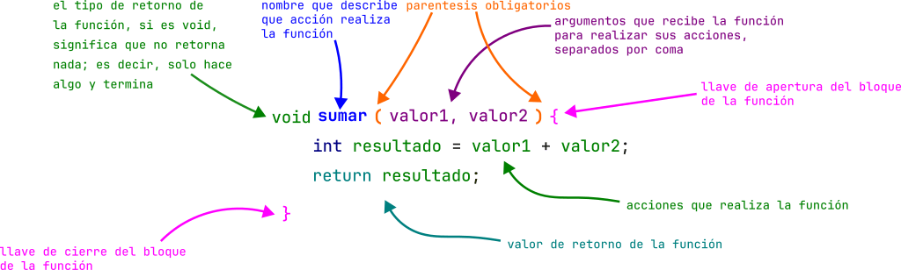
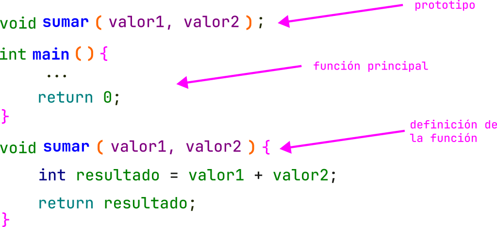

# Funciones

Una función es un bloque de código que se puede reutilizar, con esto podemos crear mejor software, mantenible y entendible.
Las funciones se pueden a llamar las veces que sean necesarias y ellas pueden existir la cantidad de instrucciones que se pueden ejecutar no tienen limite (existen buenas practicas para escribir funciones).

Tenemos varias formas para crear una función, que devuelven algún valor, que no retornen nada, que puedan recibir argumentos o ninguno, siempre todo esto esta en función de lo que vayamos a realizar.

## Tipos de retorno de una función

| Nombre | Tipo| Tipo de valor de retorno|
| --- | --- | --|
| void | `void` | No retorna nada|
| byte | `byte` | Retorna del tipo byte|
| Carácter sin signo | `unsigned char` | Retorna del tipo carácter sin singo|
| Carácter con signo | `char` | Retorna del tipo carácter con singo|
| Entero corto sin signo | `unsigned short int` o `unsigned short` | Retorna del tipo short sin signo|
| Entero corto con signo | `short int` | Retorna del tipo short con signo|
| Entero con signo | `int` | Retorna del tipo  Entero con signo|
| Entero largo | `long int` | Retorna del tipo Entero largo|
| Entero largo sin signo | `long long int` | Retorna del tipo Entero largo sin signo|
| Flotante | `float` | Retorna del tipo flotante|
| Doble | `double` | Retorna del tipo Doble|
| Doble largo | `long double` | Retorna del tipo Doble largo|

Ver mas detalles del tamaño del tipo en la [sección 2](02_tipos_datos.md#tipos-de-datos)

## Estructura de una función

La estructura de una función se conforma inicialmente por el tipo de valor que se va a retornar, seguido del nombre la función, seguido de sus paréntesis, si reciben argumentos, estos se separan por comas de lo contrario se dejan vacíos, por ultimo abrimos llave indicando que ahi inicia todo el código contenido en la función, dentro colocamos todas las instrucciones que realizara la función, por ultimo se coloca `return` si es que va a devolver algo, de lo contrario no se escribe y cerramos con la llave de cierre, lo que indica que la función termina.

> Nota: EL nombre de la función debe ser un verbo; es decir, una acción, esto debe describir qué es lo que realiza la función con tan solo leerlo.
> Nota: Una función debe solo hacer una sola cosa, si esta haciendo dos, se debe dividir la función o repensar si esta construida de manera correcta.

```c
tipoRetorno nombreFuncion(arg1, arg2, ...){
  return ; // depende si la función retorna algún valor
}
```


## Función sin retorno


## Función con retorno



## Prototipos de funciones


